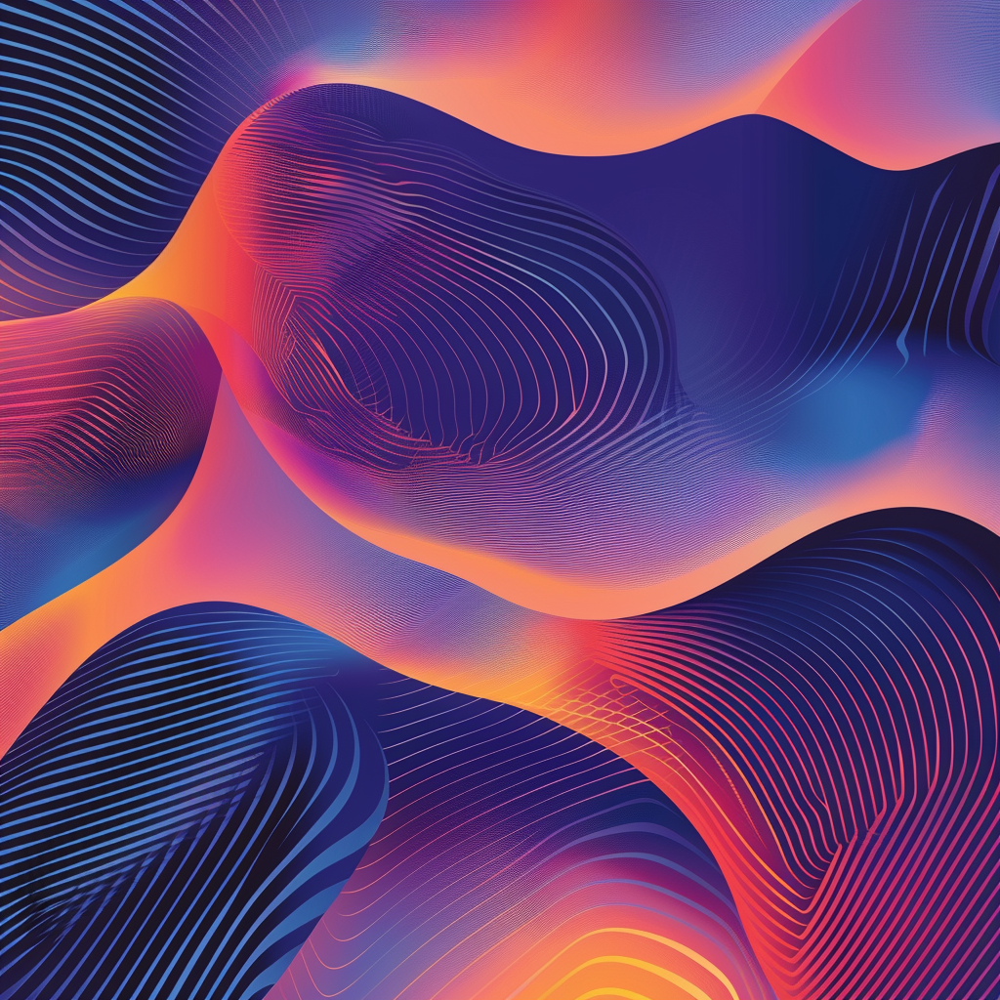

# Retail Holidays in the United States

This repository contains a list of retail holidays observed in the United States, grouped by season.

## Winter:

- Black Friday
- Cyber Monday
- Thanksgiving Day (for early Black Friday sales)
- Christmas
- New Year's Eve/Day
- Hanukkah (typically falls in late November to late December)
- Super Bowl Sunday (February, not traditionally a retail holiday, but can boost sales for certain products like TVs and snacks)

## Spring:

- Easter
- Mother's Day
- Memorial Day
- Father's Day
- Graduation season (varies by region and institution, typically May to June)
- Spring cleaning promotions (various dates, usually in March or April)

## Summer:

- Independence Day (July 4th)
- Back to School season (July to September)
- Labor Day
- Prime Day (Amazon's annual sales event, typically in July)

## Fall:

- Halloween
- Columbus Day
- Veterans Day
- Thanksgiving Day (and Black Friday)
- Cyber Monday
- Small Business Saturday (the Saturday after Thanksgiving)

## Banners backgrounds inspiration

Adobe Stock - colors waves background
https://stock.adobe.com/search?filters%5Bcontent_type%3Aphoto%5D=1&filters%5Bcontent_type%3Aillustration%5D=1&filters%5Bcontent_type%3Azip_vector%5D=1&filters%5Bcontent_type%3Avideo%5D=1&filters%5Bcontent_type%3Atemplate%5D=1&filters%5Bcontent_type%3A3d%5D=1&filters%5Bcontent_type%3Aimage%5D=1&k=colors+waves+background&order=relevance&safe_search=1&limit=100&search_page=1&search_type=usertyped&acp=&aco=colors+waves+background&get_facets=0&asset_id=222482196

Adobe Stock
https://stock.adobe.com/images/gradient-flowing-geometric-pattern-background-texture-for-poster-cover-design-minimal-color-abstract-gradient-banner-template-modern-vector-wave-shape-for-brichure/222482175

Blue Background
https://cdn.discordapp.com/attachments/1093703543422201946/1238178534074224832/busterpunc_Blue_abstract_wave_background_with_white_background._43f16485-ec6a-45f6-be6e-7f89651126d2.png?ex=663e571e&is=663d059e&hm=83ad360b1efb7cada8e49de597887c57852c8a9ef1cde14abc738942f63fad4e&

